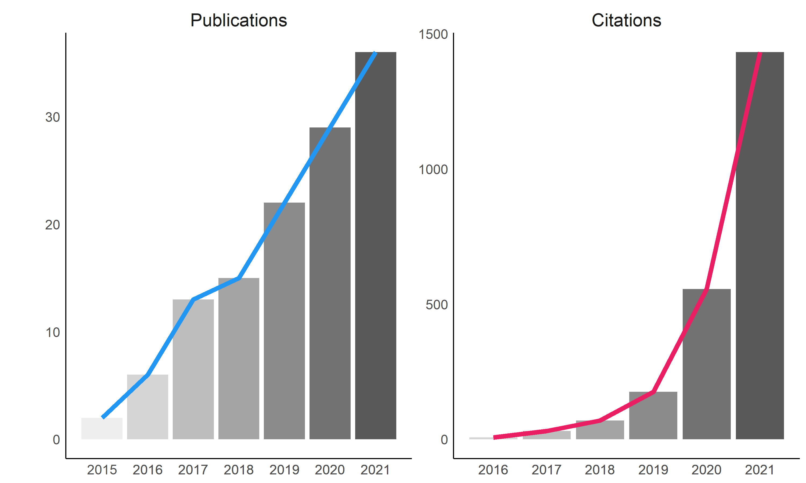

# My CV

-   My CV can be downloaded [**from
    here**](https://dominiquemakowski.github.io/CV/).
-   More information can be found on [**my
    website**](https://dominiquemakowski.github.io).

[](https://dominiquemakowski.github.io/CV/)

## Steps

The steps to pull the data from Google scholar and render the CV are the
following:

``` r
# 1. Update scientific impact data
source("make_data_impact.R")

# 4. Render CV (and CV-data)
rmarkdown::render("C:/Dropbox/PERSO/CV/DominiqueMakowski_CV.Rmd", encoding = "UTF-8")
```

## Figures


