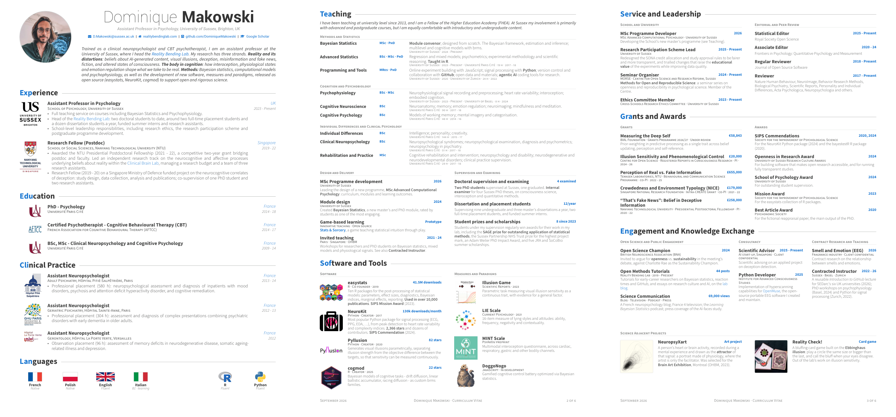
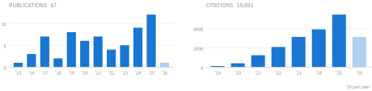

# My CV

- My CV can be downloaded [**from here**](https://dominiquemakowski.github.io/CV/).
- More information can be found on [**my website**](https://dominiquemakowski.github.io).

[](https://dominiquemakowski.github.io/CV/)

## How it is built

Everything about me is written down once, in [`PROFILE.md`](PROFILE.md), and the
CV is a *view* on it: [`cv/content/*.yml`](cv/content) selects and orders what
the CV shows, and [`publications.bib`](publications.bib) holds the bibliography.

The CV itself is built from [`cv/`](cv) with Quarto + Typst:

``` bash
cd cv && ./build.sh
```

That refreshes the impact figure, validates `cv/content/*.yml` against the
`.bib`, and writes `cv/cv.pdf` and `cv/cv.html`. See [`cv/README.md`](cv/README.md)
for the details, and [`AGENTS.md`](AGENTS.md) for how the pieces fit together.

## Impact



Numbers come from Google Scholar. `cv/tools/refresh_scholar.R` pulls them into
[`cv/content/impact.yml`](cv/content/impact.yml) and `cv/tools/make_impact.py`
redraws the figure; `build.sh` does both, so the plot never drifts from the
numbers behind it.

## Research Wordcloud

<figure>

<figcaption>
My research wordcloud, generated from the most frequent words present in my
publications.
</figcaption>
</figure>

## Collaboration Network

The data is retrieved from the Google Scholar co-author list (that one must
update ***manually*** on its scholar profile by clicking the `+` button and
accept the suggestions), thus not 100% accurate (e.g., co-authors without a
scholar profile are not listed).

<figure>

<figcaption>
My coauthors network, based on Google Scholar data.
</figcaption>
</figure>

Both figures are made by the standalone scripts in [`scripts/`](scripts), which
are run by hand and are not part of the CV build. See
[`scripts/README.md`](scripts/README.md).
