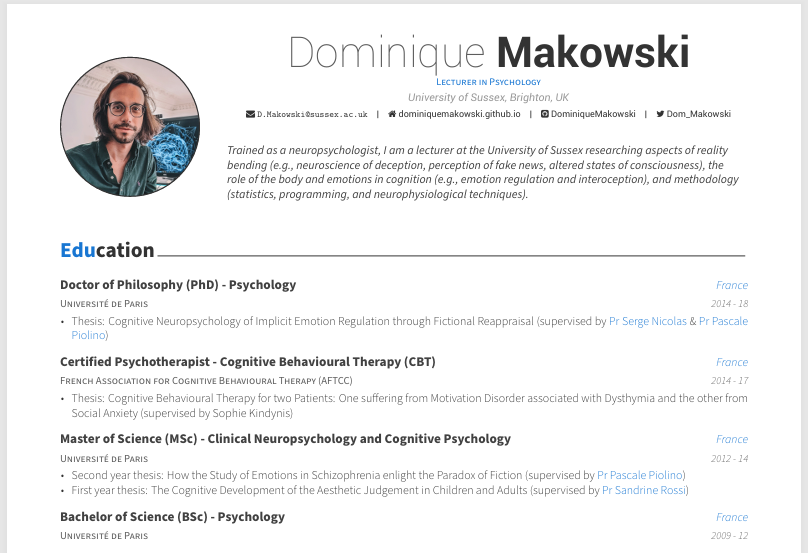
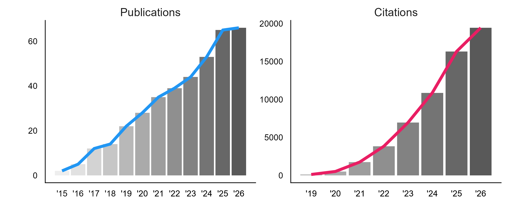

# My CV

-   My CV can be downloaded [**from
    here**](https://dominiquemakowski.github.io/CV/).
-   More information can be found on [**my
    website**](https://dominiquemakowski.github.io).

[](https://dominiquemakowski.github.io/CV/)

## Steps

The CV is built from `cv/`, with Quarto + Typst:

``` bash
cd cv && ./build.sh
```

That refreshes the impact figure, validates `cv/content/*.yml`, and writes
`cv/cv.pdf` and `cv/cv.html`. See [`cv/README.md`](cv/README.md).

The previous R Markdown + LaTeX pipeline is kept in
[`old_cv/`](old_cv/); it still produces the publication list.

``` r
# 1. Update scientific impact data
source("old_cv/make_data_impact.R")

# 2. Render CV (and CV-data)
rmarkdown::render("old_cv/DominiqueMakowski_CV.Rmd", encoding = "UTF-8")
```

## Research Wordcloud

<figure>

<figcaption>
My research wordcloud, generated from the most frequent words present in
my publications.
</figcaption>
</figure>

## Impact



## Collaboration Network

The data is retrieved from the Google Scholar co-author list (that one
must update ***manually*** on its scholar profile by clicking the `+`
button and accept the suggestions), thus not 100% accurate (e.g.,
co-authors without a scholar profile are not listed).

<figure>

<figcaption>
My coauthors network, based on Google Scholar data.
</figcaption>
</figure>
